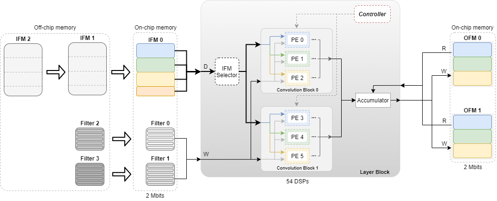
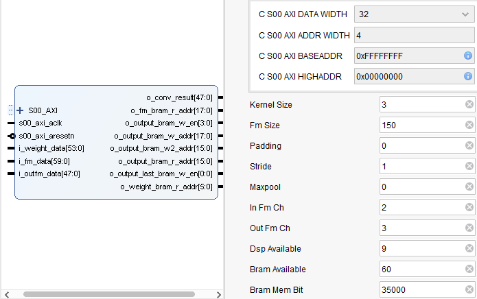
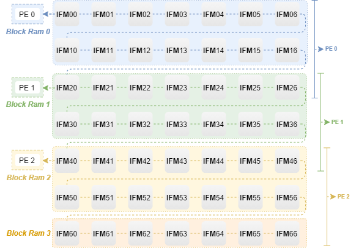
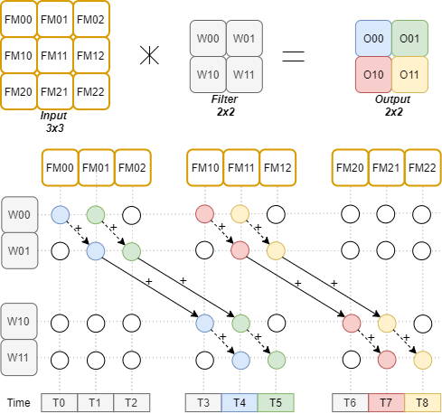
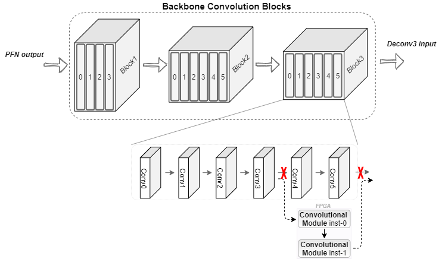

<h1> Customizable FPGA-Based Hardware Accelerator for Standard Convolution Processes </h1>

 This work fits into the need to apply CNN-based solutions optimized for point cloud in devices with reduced resources. The design and implementation of a convolutional module were proposed to implement CNNs in hardware. In terms of configurability, it is possible to adjust all typical parameters and explore parallelism depending on the resource constraints, making it a solution capable of performing any convolution found in the literature. 

<h2 align="center">
    
</h2>

 The module enables the configuration of the typical convolution parameters so it can be applied in any CNN layer. While the ReLU operation is default executed the user can enable the MaxPolling operation as a alternative of operations using stride.

<h1 align="center">
    
</h1>

 The main focus during development was the energy efficiency. However, parallelism was also integrated to enable competitive processing times. Several Processing Elements can be triggered to increase throughput. The level of parallelism is conditioned by the amount of available resources in the target hardware platform.

<h1 align="center">
    
</h1>

 Each Processing element operates with high level of efficiency. For that a cascade processing was adopted in the processing unit core to perform the operations.

<h3 align="center">
    
</h3>

 As a case study, the convolutional module was integrated with the well-known 3D object detection model for both validation and evaluate the performance in a real case scenario.
 

<h3 align="center">
    
</h3>

 Using the PointPillars model as a case study, the use of the module allowed to reduce the processing time up to 25% without compromising the detections performance.
 

<h3 align="center">
    
</h3>

 
<h4 align="center">
    Made by pedromiguelcp & duartesilva16. Project no longer under development. 🏁
    Checkout our article: https://www.mdpi.com/1424-8220/22/6/2184

    Contact me.pedropereira@gmail.com for more information!
</h4>